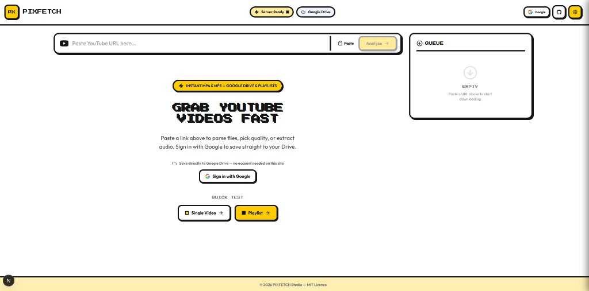

# PIXFETCH

A bold, self-hosted YouTube downloader with a retro pixel-art UI. Grab single videos, full playlists, MP3 audio, and trimmed clips — then save locally or straight to **Google Drive**.



## Features

### Downloads
- **Single video** — 1080p / 720p / 480p / 360p / MP3
- **Playlist batch download** — parse full playlists and queue with concurrency control
- **Fast stream mode** — pipe video directly to the browser (no server wait)
- **Clip downloads** — trim a start/end time range before saving
- **Resume support** — partial downloads can resume from server or local cache
- **Smart URL parsing** — Shorts, music.youtube.com, bare video IDs, messy pastes

### Google Drive
- **Sign in with Google** — via [Clerk](https://clerk.com) with Google Drive scope
- **Save to Drive** — when signed in, downloads upload directly to your Google Drive
- **Live upload progress** — queue shows upload speed, ETA, and a Drive link when done

### Links & shortcuts
- **Deep links** — `/?url=...&download=1&quality=720p` to analyze and auto-download
- **YouTube-style routes** — `/watch`, `/v/ID`, `/p/ID`, `/playlist?list=ID`
- **Bookmarklet** — drag from Settings to start a download from any YouTube tab
- **yt-dlp** — YouTube metadata, downloads, and playlists

### UI
- Pixel-art neo-brutalist design (Press Start 2P + Outfit fonts, Framer Motion animations)
- Real-time download queue with progress, speed, and ETA
- Settings panel for stream mode, auto-save, concurrency, and bookmarklet quality

## Requirements

**Docker (recommended):** Docker Compose — used for Coolify and local production-like runs.

**Local development:** Node.js 20+, ffmpeg, yt-dlp, [Clerk](https://dashboard.clerk.com) account (for Google Drive sign-in)

## Clerk + Google Drive setup

PIXFETCH uses **Clerk** for authentication. Google Drive uploads use Clerk-managed Google OAuth tokens with the `drive.file` scope.

1. Create an application at [dashboard.clerk.com](https://dashboard.clerk.com)
2. Under **User & Authentication → Social connections**, enable **Google**
3. In the Google connection settings, add this scope:
   ```
   https://www.googleapis.com/auth/drive.file
   ```
4. (Recommended) Disable other sign-in methods if you only want Google
5. For **production**, add your own Google Cloud OAuth credentials in Clerk (required for custom scopes)
6. Copy API keys into `.env`:

```env
NEXT_PUBLIC_CLERK_PUBLISHABLE_KEY=pk_test_...
CLERK_SECRET_KEY=sk_test_...
APP_URL=http://localhost:3000
```

Clerk handles OAuth redirects — you do **not** need `/api/auth/callback/google` in Google Cloud when using Clerk's shared dev keys. For production, use the redirect URI shown in the Clerk Google connection settings.

## Deploy with Coolify (Docker Compose)

1. Push this repo to GitHub/GitLab
2. In Coolify, create a new **Docker Compose** resource and point it at this repository
3. Set environment variables (or upload `.env` from [`.env.example`](.env.example)):

| Variable | Example |
|----------|---------|
| `APP_URL` | `https://pixfetch.yourdomain.com` |
| `NEXT_PUBLIC_CLERK_PUBLISHABLE_KEY` | From Clerk dashboard |
| `CLERK_SECRET_KEY` | From Clerk dashboard |

4. Expose the **`web`** service on port **3000** and assign your domain in Coolify

```bash
cp .env.example .env
# Edit .env, then:
docker compose up --build
```

## Deploy to Vercel

The frontend and API routes deploy to Vercel, but **full download functionality requires yt-dlp and ffmpeg on the server**. Vercel serverless functions do not include these tools and have execution time limits, so **Vercel is best for UI preview only**.

For production downloads, use **Docker / Coolify** or another host where you can run Node.js with yt-dlp and ffmpeg installed.

```bash
npm run build
# Connect repo in Vercel; set APP_URL, NEXT_PUBLIC_CLERK_PUBLISHABLE_KEY, CLERK_SECRET_KEY
```

## Local development

**Single Next.js fullstack app (frontend + API):**

```bash
npm install
cp .env.example .env
# Set Clerk keys (see Clerk + Google Drive setup above)
npm run dev
```

Open [http://localhost:3000](http://localhost:3000). All `/api/*` routes are handled by Next.js.

Sign in from the header or hero section. When connected via Clerk + Google, downloads go to Google Drive instead of the browser.

## Usage

1. Paste a YouTube URL and click **Analyze**
2. Choose quality (or enable clip mode with start/end times)
3. Click **Download** — signed-in users save to Drive; otherwise fast stream or server download runs locally

### Deep link from YouTube

Share or open (auto-analyzes; add `&download=1` to start download immediately):

```
http://localhost:3000/?url=https://www.youtube.com/watch?v=VIDEO_ID&download=1&quality=720p
```

### Localhost URL tricks

Change the domain in a YouTube URL from `youtube.com` to `localhost:3000` and keep the path:

```
http://localhost:3000/watch?v=VIDEO_ID
```

Short links:

```
http://localhost:3000/v/VIDEO_ID
http://localhost:3000/p/PLAYLIST_ID
http://localhost:3000/playlist?list=PLAYLIST_ID
```

Add `?quality=1080p` or `?quality=Audio%20Only` to any of the above to override the default 720p.

### Bookmarklet

Open **Settings** in the app header and drag the bookmarklet link to your bookmarks bar. It opens the current YouTube page here and starts a download at your chosen quick-link quality.

### Test checklist (localhost)

1. `curl http://localhost:3000/api/health` — yt-dlp/ffmpeg status
2. `http://localhost:3000/watch?v=dQw4w9WgXcQ` — analyze + 720p download starts
3. `http://localhost:3000/v/dQw4w9WgXcQ?quality=1080p` — 1080p download
4. `http://localhost:3000/p/PL0Zuz27SZ-6NS8GXt5nPrcYpust89zq_b` — playlist batch queue
5. Bookmarklet on a YouTube tab — new tab downloads on localhost
6. Sign in with Google (Clerk) — download saves to Drive with progress in the queue

Analyze only (no auto-download): `http://localhost:3000/?url=https://www.youtube.com/watch?v=VIDEO_ID`

## API Routes

| Route | Description |
|-------|-------------|
| `GET /api/info?url=` | Video or playlist metadata |
| `GET /api/download?id=&quality=&taskId=` | SSE server download with progress |
| `DELETE /api/download?taskId=` | Cancel an active download |
| `GET /api/download/stream?id=&quality=&start=&end=` | Direct browser stream |
| `GET /api/download/file?id=&quality=` | Serve completed file from disk |
| `GET /api/download/status?id=&quality=` | Check partial/complete download state |
| `GET /api/cloud/google-drive?id=&quality=&title=&taskId=` | SSE upload to Google Drive (requires Clerk session) |
| `GET /api/health` | yt-dlp / ffmpeg health check |

Authentication is handled by **Clerk** (not custom API routes).

## Scripts

```bash
npm run dev    # development
npm run build  # production build
npm run start  # production server
npm run lint   # ESLint
```

## Tech stack

- **Next.js 16** — App Router, React 19, API routes (fullstack)
- **Clerk** — Google sign-in and OAuth token management for Drive
- **yt-dlp** + **ffmpeg** — YouTube extraction and transcoding
- **Tailwind CSS** + **Framer Motion** — pixel UI and animations

## Notes

- Downloads are stored in `downloads/` (gitignored) and auto-cleaned after 24 hours
- Google Drive uploads use the `drive.file` scope — only files created by this app
- Public deployment may require rate limiting (enabled on API routes) and has YouTube ToS implications — intended for self-hosted use

## License

MIT — © PIXFETCH Studio
